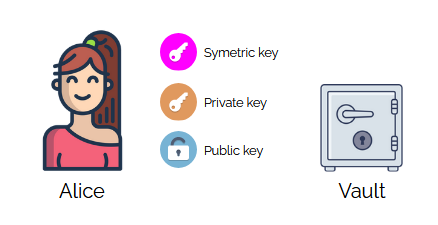
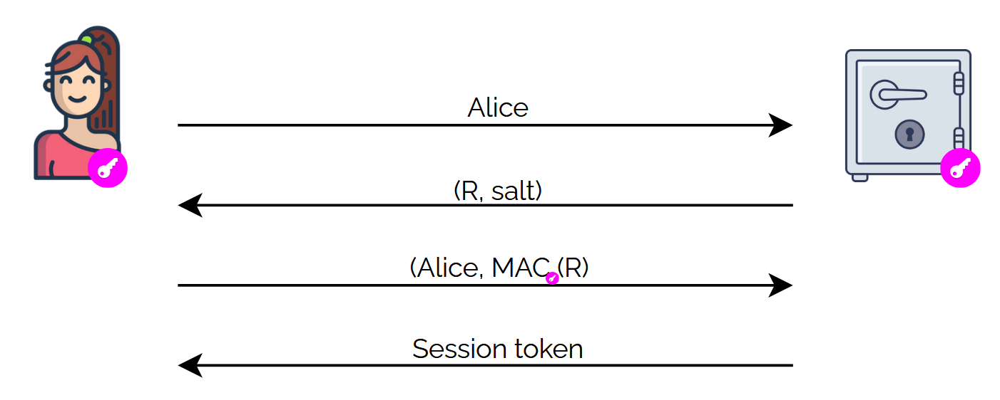
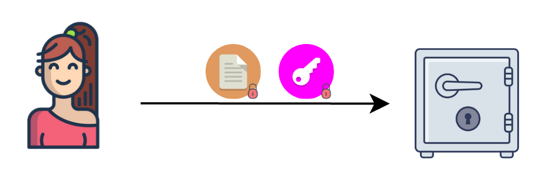
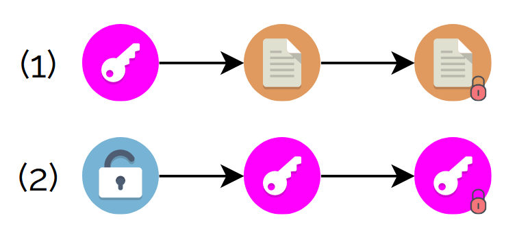
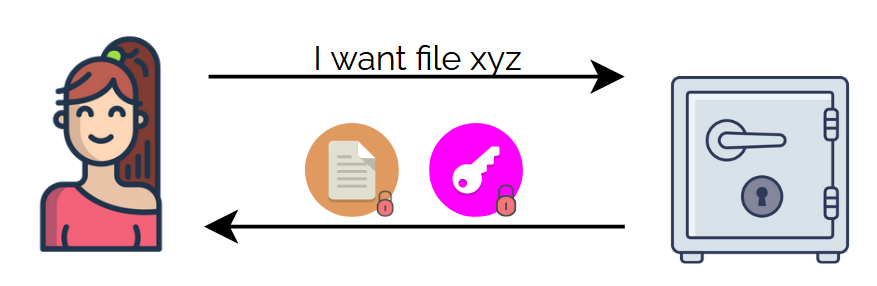
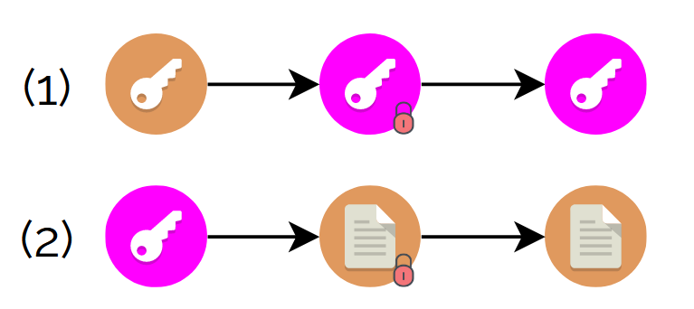

# CAA - Lab 02: Encrypted vault

<p align="center">

</p>

> Author: Doran Kayoumi
> Teacher: Alexandre Duc
> Assistant. Nathan Séville

## About Kinkō.

`Kinkō` was developed as a laboratory at the [HEIG-VD](https://heig-vd.ch/) in the academic year of 2020-2021. The purpose of the laboratory is to implement an online vault to store encrypted files.

## Getting started

**Prerequisites**	

- [Docker](https://docs.docker.com/install/) (v19.03.8-cd)
- [Docker-compose](https://docs.docker.com/compose/install/) (v1.25.4)

**Start Kinko**

First thing you need to do, is startup the database.

```bash
$ docker-compose up -d
```

Now you can start the prototype:

```bash
$ cargo run
```

Since this is only a prototype, it will simulate the `Kinkō` architecture and perform the following:

* Authentication
* Upload a file
* Download a file


## Architecture

`Kinkō`  follows a **Client-Server** model with a (imaginary) TLS 1.2/1.3 connection between them.

To make sure that the server knows nothing about the data the users upload to the vault, all of the key generation and file encryption/decryption will be done client side. The only cryptography the server will be doing is to validate the tags sent by the client.

### Legend

Here's the legend for all the following diagrams explaining the architecture.

<p align="center">

</p>

### Client-Server communication

All of the requests made between the client and the server will have attached a tag of a session token (see [Authentication](#authentication) for more info). The tag will be a **HMAC** of the session token using a **shared secret** as the key.

The shared secret is a derivation of the user' password done with **argon2id**.

### Authentication

The authentication will be done using a simple challenge response protocol. Once a user authenticates her/him self, the client will send the **name** of the user that's trying to login. The server will send back a **challenge** and the **salt** needed to (re)compute the shared secret. The client will (re)compute the shared secret, calculate the tag of the **challenge** and send it to the server. The server will check if the tag received is valid, if it is, the server will send back a **session token** (and an encrypted list of the names of all the files owned by the user).

<p align="center">

</p>

> Note: Forgot to add the the list of files returned..oops

### File upload

When a user uploads a file to the vault, it's first encrypted then sent along side the key used for the encryption (which is also encrypted).

<p align="center">

</p>

#### Encryption

The file encryption will be done using **AES-GCM** and to guarantee longterm security, the keys will have a length of **256 bits**. Since the key is also stored on the server, it will also be encrypted, but this this using **ECIES**. The reason for using asymmetric cryptography for the key encryption is to simplify file sharing. **ECIES** was chosen to avoid having to also store huge keys (since we want to have long term security).

> Note: A new key is generated for each new file being uploaded

<p align="center">

</p>


> (1) File encryption
> (2) Key encryption

### File download

For the download, the user gives the name of the file she/he wants and the server will send back the **encrypted file** and **encrypted key**.

> Note: ofc the server will check its the user requesting the file actually owns it.

<p align="center">

</p>

#### Decryption

The decryption is pretty straight forward. The symmetric key is decrypted using the users private key and then the file is decrypted using the decrypted symmetric key.

<p align="center">

</p>


> (1) Key decryption
> (2) File encryption

### File sharing

To share a file, the only thing to do is to encrypt the files encryption key with the public key of the user we want to share the file with. 

